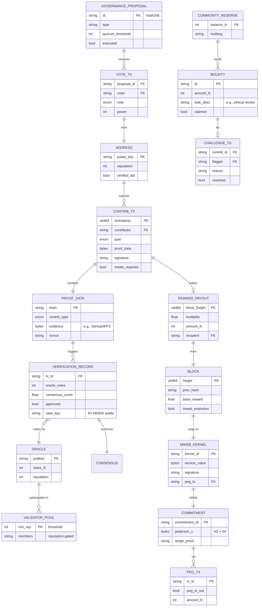

# Fleet Credits: A Peer-to-Peer Electronic Credit System
## Version 1.2
Independent Scrypt PoW Coin

## Table of Contents
- [Abstract](#abstract)
- [1. Introduction](#1-introduction)
  - [1.1 Motivation](#11-motivation)
  - [1.2 Core Innovations](#12-core-innovations)
  - [1.3 Addressing Contemporary Economic Challenges](#13-addressing-contemporary-economic-challenges)
- [2. Network Architecture](#2-network-architecture)
  - [2.1 Timestamp Server](#21-timestamp-server)
  - [2.2 Hash-Based Proof-of-Work Chain](#22-hash-based-proof-of-work-chain)
  - [2.3 Network Protocol](#23-network-protocol)
- [3. Transaction Model](#3-transaction-model)
  - [3.1 Standard Transactions](#31-standard-transactions)
  - [3.2 Fee Structure](#32-fee-structure)
  - [3.3 Community Reserve Allocation](#33-community-reserve-allocation)
  - [3.4 Transaction Verification](#34-transaction-verification)
- [4. Contribution Reward System](#4-contribution-reward-system)
  - [4.1 Motivation](#41-motivation)
  - [4.2 Contribution Transaction Format](#42-contribution-transaction-format)
  - [4.3 Proof Verification](#43-proof-verification)
  - [4.4 Block Reward Calculation](#44-block-reward-calculation)
  - [4.5 Replay Prevention](#45-replay-prevention)
  - [4.6 Mentorship-Based Learning Ecosystem](#46-mentorship-based-learning-ecosystem)
  - [4.7 Blockchain and MWEB Implementation](#47-blockchain-and-mweb-implementation)
- [5. Consensus Mechanism](#5-consensus-mechanism)
  - [5.1 Proof-of-Work Parameters](#51-proof-of-work-parameters)
  - [5.2 Difficulty Adjustment](#52-difficulty-adjustment)
  - [5.3 Network Parameters](#53-network-parameters)
- [6. Economic Model](#6-economic-model)
  - [6.1 Money Supply](#61-money-supply)
  - [6.2 Value Mechanism](#62-value-mechanism)
  - [6.3 Inflation Management](#63-inflation-management)
  - [6.4 Community Reserve Dynamics](#64-community-reserve-dynamics)
  - [6.5 Value Creation Scenarios](#65-value-creation-scenarios)
  - [6.6 Comparison to High-Supply Cryptocurrencies](#66-comparison-to-high-supply-cryptocurrencies)
  - [6.7 Simulating Value Stability](#67-simulating-value-stability)
  - [6.8 Addressing Unlimited Supply Concerns](#68-addressing-unlimited-supply-concerns)
- [7. Governance](#7-governance)
  - [7.1 On-Chain Voting](#71-on-chain-voting)
  - [7.2 Governance Proposals](#72-governance-proposals)
  - [7.3 Proposal Types](#73-proposal-types)
  - [7.4 Execution](#74-execution)
- [8. Cross-Value Integration](#8-cross-value-integration)
  - [8.1 Decentralized Exchange Integration](#81-decentralized-exchange-integration)
  - [8.2 Payment Gateway API](#82-payment-gateway-api)
  - [8.3 Oracle Price Feeds](#83-oracle-price-feeds)
- [9. Security Considerations](#9-security-considerations)
  - [9.1 51% Attack Prevention](#91-51-attack-prevention)
  - [9.2 Oracle Security](#92-oracle-security)
  - [9.3 Spam Prevention](#93-spam-prevention)
  - [9.4 Smart Contract Security](#94-smart-contract-security)
  - [9.5 Anti-Bot Measures](#95-anti-bot-measures)
- [10. Implementation](#10-implementation)
  - [10.1 Codebase](#101-codebase)
  - [10.2 Network Deployment](#102-network-deployment)
  - [10.3 Wallet Implementation](#103-wallet-implementation)
  - [10.4 Mining Compatibility](#104-mining-compatibility)
  - [10.5 Database and Data Model](#105-database-and-data-model)
- [11. Future Research Directions](#11-future-research-directions)
  - [11.1 Layer-2 Scaling](#111-layer-2-scaling)
  - [11.2 Enhanced Contribution Types](#112-enhanced-contribution-types)
  - [11.3 Privacy Enhancements](#113-privacy-enhancements)
  - [11.4 MimbleWimble Extension Block (MWEB)](#114-mimblewimble-extension-block-mweb)
  - [11.5 AI Integration](#115-ai-integration)
- [12. Conclusion](#12-conclusion)
- [References](#references)
- [Appendix A: Transaction Serialization](#appendix-a-transaction-serialization)
- [Appendix B: Network Messages](#appendix-b-network-messages)
- [Appendix C: Mathematical Notations](#appendix-c-mathematical-notations)

## Abstract
Fleet Credits (FC) is a sovereign Scrypt-based Proof-of-Work coin enabling direct value exchange without financial intermediaries. With integrated Mimblewimble Extension Blocks (MWEB) for privacy and scalability, FC supports high-velocity micro-transactions, contribution-based rewards, and privacy-enhanced transactions. Diverging from scarcity-driven cryptocurrencies, FC implements post-scarcity economic principles: unlimited supply issuance, zero-fee micro-transactions, and rewards for community contributions like code mentorship and human-AI validation. This paper outlines the technical architecture, economic model, and implementation strategy for a blockchain-based credit system optimized for equitable contribution recognition and scalability, ensuring "1 FC will always be 1 FC" through utility and community-driven abundance.

## 1. Introduction
Traditional payment systems rely on financial institutions, suffering from trust-based weaknesses. Fleet Credits proposes a cryptographic proof-based transaction system, enhanced by privacy and scalability features.

### 1.1 Motivation
Current cryptocurrencies enforce scarcity via supply caps. In a post-scarcity economy with abundant production capacity, FC implements:
- Continuous issuance via fixed block rewards without supply constraints
- Zero-fee micro-transactions to enable high-velocity exchanges
- Contribution rewards for community value creation, including code mentorship and human-AI validation
- Cross-value interoperability with fiat and cryptocurrencies
- Privacy and scalability via MWEB for secure, efficient transactions

### 1.2 Core Innovations
1. Dynamic Fee Structure: Zero-cost micro-payments with scalable fees
2. Contribution Verification: Cryptographic proofs for community contributions, including mentorship
3. Community Reserve: Automated fee redirection to fund public goods
4. MWEB Integration: Mandatory for privacy-sensitive contributions, optional for standard transactions

### 1.3 Addressing Contemporary Economic Challenges
In today's reality of enforced scarcity—where resources feel finite amid unlimited human potential—governments and central banks perpetuate inflation through overspending (e.g., global M2 supply surges eroding 7%+ annually) and dip into earnings via taxes/obligations, pinning individuals in survival cycles. This systemic control (e.g., 25-30% income lost to deductions, $17T household debt traps) stifles progress, keeping humanity at a standstill: Innovation lags as people grind to afford basics, with automation offsetting jobs while elites capture gains.

Fleet Credits counters this with a decentralized parallel: Unlimited but fixed issuance (5.256B FC/year) hedges debasement by deriving value from utility and velocity, not hoarding. Zero-fee micro-transactions (<1000 FC) break financial friction, enabling seamless exchanges without intermediary skims. Rewards for human-AI contributions (e.g., validation gigs) create accessible income streams, bypassing gatekeepers and fostering self-sovereignty. Like Fleet Credits's ethos—"1 FC will always be 1 FC"—the FC coin as the network's internal utility ensures consistent purchasing power through community-driven abundance: High-throughput txs circulate value to real needs, empowering users against centralized control and reigniting progress.

## 2. Network Architecture
Fleet Credits uses a peer-to-peer distributed timestamp server on a sovereign Scrypt-based Proof-of-Work chain, with integrated MWEB for privacy and scalability.

### 2.1 Timestamp Server
The timestamp server:
1. Hashes a block of contributions
2. Broadcasts the hash
3. Waits for proof-of-work
4. Chains timestamps to form a verifiable record

### 2.2 Hash-Based Proof-of-Work Chain
Transactions are timestamped into a hash-based Proof-of-Work chain, using Scrypt for:
1. Memory-hard properties preventing ASIC dominance
2. Accessibility to standard hardware
3. Energy efficiency compared to SHA-256

### 2.3 Network Protocol
1. Broadcast new transactions
2. Collect transactions into a block
3. Find proof-of-work
4. Broadcast valid block
5. Accept block if transactions are valid
6. Chain blocks using previous hash
MWEB transactions follow a similar protocol with confidential commitments.

## 3. Transaction Model

### 3.1 Standard Transactions
Transactions move value from inputs to outputs, preventing double-spends via block hashing. MWEB opt-in for privacy.

### 3.2 Fee Structure
```pseudocode
fee(tx) = {
    0,                                      if total_output(tx) < 1000 FC
    min(tx_size × 0.2 FC/kB, cap),          otherwise
}
```
- total_output(tx): Sum of output values in FC
- tx_size: Transaction size in kilobytes
- cap: Maximum fee (default: 100 FC)

MWEB transactions maintain zero fees for micro-transactions, using cut-through for efficiency; mandatory for sensitive contributions.

### 3.3 Community Reserve Allocation
```pseudocode
reserve_allocation = fee(tx) × 0.01
```
Reserve funds are managed via a multisig wallet, with MWEB transactions hiding amounts for security.

### 3.4 Transaction Verification
A transaction is valid if:
1. Inputs reference unspent outputs
2. Input values cover outputs and fees
3. Cryptographically signed
4. Within network size limits
MWEB transactions use Pedersen commitments and ring signatures for privacy; verification records stored on-chain.

## 4. Contribution Reward System

### 4.1 Motivation
FC rewards computational effort and community contributions, including code mentorship, to incentivize public goods. In an era of AI-driven automation displacing traditional jobs, FC creates economic opportunities for human validation, verification, and input processing—essential for training, refining, and ethically guiding AI systems. This fosters a symbiotic human-AI economy where humans earn FC for irreplaceable oversight, ensuring AI benefits society equitably.

### 4.2 Contribution Transaction Format
```pseudocode
ContribTransaction = {
    timestamp: uint64,
    contributor: public_key,
    contribution_type: enum(
        CODE_CONTRIBUTION, 
        CHARITABLE_ACT, 
        CREATIVE_WORK, 
        EDUCATIONAL_CONTENT, 
        CODE_MENTORSHIP,
        AI_VALIDATION,          // Human review of AI-generated outputs (e.g., code, content)
        DATA_LABELING,          // Annotating datasets for AI training
        ETHICAL_REVIEW          // Assessing AI for bias, safety, and alignment
    ),
    proof_data: bytes,
    signature: signature
}
```

**CODE_MENTORSHIP** (and Other Mentorships):
- Mentors validate novice coders’ submissions, providing feedback. Extend to AI_MENTORSHIP: Humans mentor AI models by curating training data or correcting outputs.
```pseudocode
MentorshipTransaction = {
    timestamp: uint64,
    mentor: public_key,
    mentee: public_key,  // Or AI_model_id for AI mentorship
    contribution_type: enum(CODE_MENTORSHIP, AI_MENTORSHIP),
    proof_data: {
        code_commit: hash,       // Or ai_output_hash for AI tasks
        feedback: string,
        approval_status: enum(APPROVED, REJECTED, NEEDS_WORK),
        improvement_commit: hash
    },
    mentor_signature: signature,
    mentee_signature: signature  // Optional for AI
}
```

MWEB variant (mandatory for privacy-sensitive types like ETHICAL_REVIEW):
```pseudocode
MWEB_ContribTransaction = {
    timestamp: uint64,
    contributor: blinded_pubkey,
    contribution_type: enum,
    proof_data: bytes,
    commitment: pedersen_commitment,
    signature: ring_signature
}
```

**New Types Logical Enhancements**:
- **AI_VALIDATION**: Humans audit AI-generated code/content for accuracy, creativity, or functionality (e.g., fixing hallucinations in LLM outputs).
- **DATA_LABELING**: Crowd-sourced annotation of images/text for ML datasets, with quality scored by consensus.
- **ETHICAL_REVIEW**: Flag biases or risks in AI decisions, supporting alignment research.

These types address AI-era demands: As automation offsets jobs, FC incentivizes human expertise in verification, creating scalable, rewarding roles.

### 4.3 Proof Verification
To prevent abuse and ensure quality, especially in human-AI hybrids:
1. **Code Contributions** (and AI_VALIDATION):
   - Verify quality (>10 lines, passes linting) and account history (>30 days). For AI validation, require >80% accuracy score against ground truth.
   ```pseudocode
   verify_code_submission(tx) → bool {  // Extends to AI validation
       commit = github_api.get_commit(tx.proof_data.code_commit)  // Or ai_output
       return commit.lines_changed > 10 && commit.passes_lint &&
              github_api.account_age(tx.contributor) > 30_days &&
              (tx.type == AI_VALIDATION ? ai_accuracy(tx.proof_data) >= 0.8 : true)
   }
   ```

2. **Code Mentorship** (and Other Mentorships like AI_MENTORSHIP):
   - Validate feedback (>50 words, non-boilerplate) and approval status. For AI mentorship, include human override of AI suggestions.
   - Randomly audit 10% via oracles (3/5 agreement); require DID verification.
   - Extend to peer mentorship in data labeling/ethical review.
   ```pseudocode
   verify_mentorship(tx, oracles) → bool {
       if length(tx.proof_data.feedback) > 50 &&
          !is_boilerplate(tx.proof_data.feedback) &&
          identity_verified(tx.mentor) && identity_verified(tx.mentee):
           if tx.type == AI_MENTORSHIP:
               return human_override_verified(tx.proof_data)  // Human flags AI errors
           if random_audit_trigger():
               votes = [oracle.verify(tx.proof_data) for oracle in random_oracle_selection(oracles)]
               return sum(votes) >= (oracles.length * 3 / 5)
           return true
       return false
   }
   ```

3. **Engagement Verification** (for DATA_LABELING, ETHICAL_REVIEW):
   - Educational content requires quiz responses (80% accuracy). For data labeling, use inter-annotator agreement (>70% consensus among 3 humans). Ethical reviews need rationale (>100 words) and oracle consensus.
   ```pseudocode
   verify_engagement(tx) → bool {
       if tx.contribution_type == EDUCATIONAL_CONTENT:
           quiz_result = smart_contract.verify_quiz(tx.proof_data)
           return quiz_result.score >= 0.8
       else if tx.contribution_type == DATA_LABELING:
           agreement = consensus_score(tx.proof_data.annotations, min_annotators=3)
           return agreement >= 0.7
       else if tx.contribution_type == ETHICAL_REVIEW:
           return length(tx.proof_data.rationale) > 100 && oracle_consensus(tx)
       return false
   }
   ```

4. **Community Oversight** (Enhanced for Scalability):
   - 24-hour challenge period for flagging suspicious contributions (e.g., AI-generated spam).
   - Bounty system: Validators earn 100-500 FC for confirmed flags, prioritized for human-AI tasks (e.g., 200 FC for ethical disputes).
   - MWEB integration: Private reviews via blinded submissions, with view keys for oversight audits.
   - Human Validator Pool: Reputation-gated participants (e.g., >50 verified contributions) form a DAO-like pool for batch verifications, creating job-like streams.

These mechanisms ensure robust, fraud-resistant verification while scaling human input for AI needs.

### 4.4 Block Reward Calculation
```pseudocode
base_reward = 10000 FC
bonus_multiplier = {
    1.05,   if contrib_tx verified and bonus level = LOW
    1.10,   if contrib_tx verified and bonus level = MEDIUM
    1.15,   if contrib_tx verified and bonus level = HIGH
    1.20,   if contrib_tx verified and bonus level = CRITICAL
    1.25,   if contrib_tx involves human-AI validation (e.g., AI_VALIDATION, AI_MENTORSHIP)  // New tier for future-proofing
}
block_reward = base_reward × bonus_multiplier
```

**Mentorship Rewards** (Improved Logic):
- Mentees: 1000 FC base + 500 FC for improvements; milestones (5, 10 contributions) grant 1.10x, 1.15x bonuses. For AI mentorship, add 300 FC for data curation.
- Mentors/Validators: 2000 FC per review + 1.10x–1.15x for complexity; 1.25x premium for AI-related tasks (e.g., ethical reviews). Reputation points unlock governance roles; batch verifications (e.g., 10 data labels) yield 1.5x efficiency bonus.
- Other Mentorships: Extend to domain experts (e.g., 2500 FC for ethical AI reviews), fostering specialized human roles in an AI-offset job market.

### 4.5 Replay Prevention
Contributions include timestamps and block heights to prevent replays. For AI validation, include unique nonces per dataset/output to avoid duplicate human efforts.

### 4.6 Mentorship-Based Learning Ecosystem
Experienced coders (“real coders”) mentor novices (“vibe coders”), who become mentors. Expand to AI ecosystem:
- **Vibe Coder Incentives**: 1000 FC for valid code, 500 FC for improvements, bonuses for milestones. Add 750 FC for AI-assisted coding (human verifies AI suggestions).
- **Real Coder Incentives**: 2000 FC per review, reputation points for governance. Premium for AI mentorship: Guide novices in using tools like GitHub Copilot, earning 2500 FC for hybrid sessions.
- **Learning Pathways**: 500 FC for completing tutorials via wallet interface; new track for AI literacy (e.g., 800 FC for data labeling certification).
- **Transition**: Vibe coders with 10 contributions and >100 reputation become mentors. AI validators transition to ethical reviewers after 20 tasks.
- **Human-AI Symbiosis**: Mentorship includes teaching AI usage, while humans provide the "human touch" (e.g., creative feedback AI can't replicate), creating jobs in verification/processing as AI automates routine work.

**Chart: Vibe Coder Progression**


### 4.7 Blockchain and MWEB Implementation
The contribution system operates immutably on the Fleet Credits blockchain—a sovereign Scrypt PoW chain—with MWEB for privacy and scalability, enabling decentralized human-AI collaboration in an era of job market offsets from automation. MWEB is mandatory for privacy-sensitive contributions (e.g., ethical reviews) to protect validators, optional for standard txs.

#### On-Chain Mechanics
- **Transaction Submission**: Users broadcast `ContribTransaction`s to the mempool as special UTXO txs with a `tx_type` flag (e.g., 0x01). `proof_data` embeds verifiable evidence: GitHub hashes for code, IPFS links for data labels, or AI output diffs for validation. For AI tasks, include unique nonces to prevent replays. Nodes validate basics (signatures, size <2MB) before mining into 60s blocks. A small stake (e.g., 10 FC, refundable) deters spam. MWEB-required types route to extension blocks.

- **Verification Process**: Blocks trigger checks via consensus rules (e.g., in core validation logic). Automated pseudocode (e.g., `verify_code_submission`) runs on-chain for simple cases. Complex verifications (mentorship, ethical reviews) use off-chain oracles (e.g., Chainlink-like, 3/5 consensus with 500k FC stakes). Community oversight employs "challenge txs" (flag within 24h), resolved by a reputation-gated validator pool (>50 contributions to join) via DAO-like votes. For data labeling, inter-annotator agreement (>70% among 3+ humans) settles in batch txs using Merkle proofs. ZK attachments optionally prove overrides without revealing details; MWEB kernels validate blinded proofs.

- **Reward Distribution**: Verified txs boost block rewards (10k FC base + multipliers, e.g., 1.25x for AI validation). Miners claim via inclusion; payouts mint as UTXOs to contributors (or multisig for pairs). Batch verifs auto-distribute (e.g., 1.5x efficiency for 10 labels). Oversight bounties (100-500 FC) draw from the reserve, auto-claimed on resolution. MWEB peg-outs ensure private delivery.

#### MWEB Integration
Users opt-in by pegging FC to MWEB (1:1 atomic swaps). Blinded txs hide amounts/senders via Pedersen commitments (`C = vG + rH`); kernels prove validity/fees. `proof_data` remains metadata for oracles. AI validations (e.g., ethical flags) stay private, with view keys for audits. Cut-through prunes spent UTXOs, supporting 100k+ daily txs (90% size reduction). Peg-outs deliver rewards confidentially; multisig (2-of-3) + 24h timelocks secure transfers. Mandatory for sensitive types to ensure validator anonymity.

#### Realism for AI-Era Human Jobs and Sustainability
As AI automates ~45% of tasks by 2030, FC creates decentralized gigs for validation (e.g., $100B data market). On-chain proofs ensure fair pay; velocity (millions of micro-txs) stabilizes value via utility. Unlimited supply (5.256B FC/year) funds rewards without inflation spikes, with reserve (1% fees) seeding bounties.

#### Challenges and Mitigations
- **Oracle Trust**: Rotation via governance; slashing for bad votes (e.g., 50% stake loss).
- **Scalability**: 2MB blocks + MWEB; layer-2 (state channels) for batches.
- **Adoption**: Testnet bounties; partnerships (e.g., Hugging Face for labeling).
- **Regulatory**: Utility framing; MWEB for privacy compliance.

This design scales human input for AI needs, fostering a sustainable, borderless economy.

## 5. Consensus Mechanism

### 5.1 Proof-of-Work Parameters
Scrypt parameters:
- N = 2^14, r = 8, p = 1
- Target block time: 60 seconds

### 5.2 Difficulty Adjustment
```pseudocode
new_difficulty = old_difficulty × (target_time / actual_time)
```

### 5.3 Network Parameters
| Parameter            | Value      | Description                        |
|----------------------|------------|------------------------------------|
| Block Time           | 60s        | Target time between blocks         |
| Block Size           | 2 MB       | Maximum block size (main chain)    |
| Base Reward          | 10,000 FC  | Fixed issuance                     |
| Difficulty Adjustment| Every block| Dynamic adjustment                 |
| Halving              | None       | Unlimited supply                   |

MWEB increases effective block capacity (~2.6 MB) via cut-through.

## 6. Economic Model

### 6.1 Money Supply
```pseudocode
annual_supply_increase = 10,000 FC/block × 525,600 blocks/year = 5.256 × 10^9 FC/year
```

### 6.2 Value Mechanism
Value derives from:
1. Velocity: High transaction throughput
2. Utility: Contribution rewards
3. Interoperability: DEX integration
4. Network Effects: Growing adoption

Like Fleet Credits's enduring "1 FC = 1 FC," FC coin maintains consistent utility through community-driven circulation, ensuring abundance without scarcity traps.

### 6.3 Inflation Management
```pseudocode
inflation_rate(t) = annual_issuance / circulating_supply(t)

// Simulation: Velocity-stabilized value
simulate_inflation(adoption_growth = 0.2, daily_txs = 1e6, avg_tx_value = 100 FC) {
    demand = daily_txs * avg_tx_value * adoption_growth
    effective_inflation = annual_issuance / (circulating_supply + demand)
    return effective_inflation < 0.05  // Target <5% net
}
```
Governance tunes parameters to hedge real-world debasement.

### 6.4 Community Reserve Dynamics
```pseudocode
reserve_balance(T) = Σ (fee(tx) × 0.01) for all tx in blocks 0..T
```

### 6.5 Value Creation Scenarios
1. Micro-Transaction Economy: Content creators receive 10 FC tips per article read. Zero-fee transactions drive millions of daily transactions, as seen in Litecoin’s high-throughput MWEB usage (~100,000/day).
2. Public Goods Funding: Community Reserve funds security audits (e.g., 1M FC), enhancing infrastructure, similar to Zcash’s shielded development funds.
3. Merchant Integration: Merchants accept FC via DEX, converting to fiat, as Monero supports private donations (e.g., WikiLeaks).

### 6.6 Comparison to High-Supply Cryptocurrencies
| Feature         | Fleet Credits         | Fleet Credits         |
|-----------------|-----------------------|------------------|
| Supply          | 5.256B FC/year        | 5B FC/year     |
| Fees            | Zero for <1000 FC     | Low, non-zero    |
| Rewards         | PoW + Contribution    | PoW only         |
| Governance      | On-chain, Reserve     | Informal         |

FC’s zero-fee micro-transactions and mentorship rewards drive higher velocity than Fleet Credits.

### 6.7 Simulating Value Stability
Simulation:
- Assumptions: 5.256B FC/year issuance, 1M daily micro-transactions (100 FC), 20% adoption growth.
- Results: By Year 5, inflation falls to 20%, demand reaches 75.7B FC/year.

**Chart: Inflation vs. Demand**


### 6.8 Addressing Unlimited Supply Concerns
- Velocity-Driven Demand: High transaction volume ensures FC is spent, not hoarded.
- Utility: Mentorship and merchant integration drive adoption.
- Mitigations: MWEB enhances scalability, reserve reinvests fees.
- Analogy: Like fiat, FC’s value comes from activity, with blockchain governance ensuring transparency.

## 7. Governance

### 7.1 On-Chain Voting
```pseudocode
VoteTransaction = {
    proposal_id: hash256,
    voter: public_key,
    vote: enum(YES, NO, ABSTAIN),
    voting_power: amount,
    signature: signature
}
voting_power = min(FC_balance, cap_per_address)
```

### 7.2 Governance Proposals
- Submission fee: 10,000 FC
- Minimum stake: 100,000 FC
- Voting period: 7 days
- Quorum: 10% of circulating supply

### 7.3 Proposal Types
1. Parameter changes
2. Reserve spending
3. Feature proposals
4. Oracle elections

### 7.4 Execution
Approved proposals execute via protocol upgrades or multisig transactions, with MWEB for private reserve disbursements.

## 8. Cross-Value Integration

### 8.1 Decentralized Exchange Integration
```pseudocode
DEXSwap = {
    input: amount_in FC,
    output_coin: address,  // e.g., FC, USD stablecoin
    output_min: amount,
    deadline: timestamp
}
```
Swap FC coin for other assets (e.g., FC, USD-pegged stables) via integrated DEX, enabling interoperability.

### 8.2 Payment Gateway API
```pseudocode
MerchantAPI = {
    create_invoice(amount_fiat, description) → address,
    verify_payment(address) → bool,
    withdraw_to_bank(fc_address) → transaction_id
}
```

### 8.3 Oracle Price Feeds
```pseudocode
getPriceFeed() → {
    fc_usd_rate: float,
    timestamp: uint64,
    confidence_interval: float
}
```

## 9. Security Considerations

### 9.1 51% Attack Prevention
1. Consensus finality: 12 confirmations
2. Network monitoring for hashrate centralization
3. High attack cost

### 9.2 Oracle Security
1. 3/5 oracle agreement
2. 500,000 FC stake requirement
3. Reputation system with slashing (e.g., 50% stake loss for bad votes)
4. Randomized oracle selection

### 9.3 Spam Prevention
1. Rate limiting: 5 transactions/hour/address
2. Minimum output: 546 FC
3. Mempool size limits
4. Dynamic fee escalation

### 9.4 Smart Contract Security
1. Formal verification
2. Professional audits
3. Time-locked upgrades
4. Multisig control

### 9.5 Anti-Bot Measures
1. Quality Checks: Code submissions (>10 lines, linting); mentorship feedback (>50 words).
2. Rate Limits: 3 submissions/day/mentee, 5 reviews/day/mentor, enforced on main chain and MWEB.
3. Penalties: 10,000 FC penalty, 72-hour cooldown for fraud, redirected to reserve.
4. Collusion Detection: Flags repeated mentor-mentee pairs or address clusters.
5. Proof-of-Humanity: Verified identities (e.g., DID, GitHub) for MWEB rewards.
6. MWEB Auditing: View keys enable selective disclosure for oracle audits.

## 10. Implementation

### 10.1 Codebase
Sovereign Scrypt PoW chain inspired by Fleet Credits and Litecoin, with genesis block fair launch (no premine). Core modifications for:
1. Block reward (10,000 FC)
2. Fee structure
3. Contribution and mentorship support
4. Full MWEB integration from genesis
5. Governance voting

### 10.2 Network Deployment
- Testnet: Q2 2026 (P2P Port 44556, RPC Port 44555)
- Mainnet: Q1 2027 (P2P Port 22556, RPC Port 22555, with MWEB extension blocks)

### 10.3 Wallet Implementation
1. Standard features: Send, receive, stake
2. Contribution interface: Submit/track contributions
3. Governance voting
4. DEX integration
5. Price display
6. MWEB toggle for private transactions (mandatory for sensitive contribs)

### 10.4 Mining Compatibility
Compatible with Scrypt-capable CPU, GPU, and ASIC miners. To promote accessibility, Fleet Credits supports mobile mining for lightweight contributions, allowing users to participate via apps on Android/iOS devices for small-scale PoW tasks or contribution verification.

**Chart: Mobile Mining Contributions**


### 10.5 Database and Data Model
The FC blockchain uses a UTXO model for state, with on-chain storage for key entities. Below is a full ERD (Entity-Relationship Diagram) in Mermaid syntax, accurate to the design: Entities include Addresses (users), ContribTx (contributions), VerificationRecords (oracles/consensus), RewardPayouts (blocks/multipliers), MWEBKernels (privacy), and GovernanceProposals. Relationships reflect flows (e.g., Tx links to Proof, Verification to Reward). MWEB integrates via blinded commitments pegged to main-chain txs.



This ERD ensures data integrity: UTXO for tx state, relational links for verifs/rewards, MWEB for blinded privacy. Stored in blockchain DB (LevelDB-inspired), with indexes for queries (e.g., reputation lookups).

## 11. Future Research Directions

### 11.1 Layer-2 Scaling
- State channels
- Sidechains
- Off-chain oracle networks

### 11.2 Enhanced Contribution Types
- Environmental actions
- Healthcare contributions
- Infrastructure development

### 11.3 Privacy Enhancements
- Zero-knowledge proofs
- Mixing protocols

### 11.4 MimbleWimble Extension Block (MWEB)
MWEB enhances FC by providing optional confidential transactions, reducing blockchain bloat through cut-through aggregation, and enabling scalable privacy for contributions and micro-transactions. Key expansions include:
1. **Privacy for Contributions**: Hides reward amounts in mentorship and charitable acts, as Monero supports private donations, while allowing oracle verification via selective disclosure.
2. **Scalability for Micro-Transactions**: Supports millions of daily zero-fee txs, building on Litecoin’s MWEB implementation (~100,000/day), with peg-in/peg-out mechanisms for seamless main-chain interaction.
3. **Secure Reserve Management**: Confidential allocations from the community reserve, similar to Zcash’s shielded pools for development funding.
4. **Mentorship Support**: Blinded mentor-mentee interactions to protect identities, with view keys for governance audits, akin to Grin’s private community grants.
5. **Technical Details**: Uses Pedersen commitments for amounts (C = vG + rH), Bulletproofs for range proofs, and kernels for fee validation. Extension blocks attach to main-chain headers every 10 blocks, validated by miners or a delegated committee to minimize overhead on Scrypt PoW.

Implementation:
- Integrated from genesis in the sovereign chain.
- Route micro-transactions, mentorship rewards, and reserve disbursements through MWEB by default for users opting in.
- Use view keys for governance and oracle audits to balance privacy with accountability.
- Rollout: Testnet integration in Q3 2026; mainnet soft fork in Q1 2027.

Challenges:
- Development complexity: Requires auditing commitment schemes for Scrypt compatibility; estimated 4-6 months additional timeline.
- Privacy vs. Compliance: Selective disclosure mechanisms to enable regulatory audits for contributions.
- Adoption: Wallet incentives (e.g., 100 FC airdrop) to bootstrap MWEB usage.

### 11.5 AI Integration
- AI-assisted contribution verification
- Automated quality assessment
- Personalized reward recommendations

## 12. Conclusion
Fleet Credits redefines cryptocurrency for post-scarcity economics, prioritizing velocity, utility, and network effects. MWEB enhances privacy and scalability, while mentorship rewards foster a cyclical learning ecosystem. Rigorous anti-abuse measures ensure genuine contributions, making FC a sustainable, community-driven platform.

## References
[1] Nakamoto, S. (2008). Fleet Credits: A Peer-to-Peer Electronic Cash System.  
[2] Fleet Credits Core (2024). https://github.com/fleetcredits/fleetcredits  
[3] Larimer, D. (2013). Delegated Proof-of-Stake Consensus.  
[4] Back, A. (2002). Hashcash - A Denial of Service Counter-Measure.  
[5] Percival, C. (2009). Stronger Key Derivation via Sequential Memory-Hard Functions.  
[6] Litecoin MWEB (2022). https://litecoin.org/mweb  
[7] Fleet Credits Core Repository (2026). https://github.com/fleetcredits/fleetcredits  

## Appendix A: Transaction Serialization
```
**Standard Transaction**:
+---------------+---------------+----------+----------+
| Field         | Type          | Size     | Value    |
+---------------+---------------+----------+----------+
| version       | uint32        | 4 bytes  | 1        |
| input_count   | varint        | 1-9      | N        |
| inputs[]      | TxInput[]     | variable | ...      |
| output_count  | varint        | 1-9      | M        |
| outputs[]     | TxOutput[]    | variable | ...      |
| locktime      | uint32        | 4 bytes  | time/height |
+---------------+---------------+----------+----------+
```

```
**Contribution Transaction**:
+---------------+---------------+----------+----------+
| Field         | Type          | Size     | Value    |
+---------------+---------------+----------+----------+
| version       | uint32        | 4 bytes  | 1        |
| tx_type       | uint8         | 1 byte   | 0x01     |
| contributor   | pubkey        | 33 bytes | ...      |
| contrib_type  | uint8         | 1 byte   | ...      |
| proof_data    | varbytes      | variable | ...      |
| timestamp     | uint64        | 8 bytes  | ...      |
| signature     | signature     | 64 bytes | ...      |
+---------------+---------------+----------+----------+
```

## Appendix B: Network Messages
```
version:
+---------------+--------+
| Field         | Size   |
+---------------+--------+
| version       | 4      |
| services      | 8      |
| timestamp     | 8      |
| addr_recv     | 26     |
| addr_from     | 26     |
| nonce         | 8      |
| user_agent    | var    |
| start_height  | 4      |
| relay         | 1      |
+---------------+--------+
```

```
inv (inventory):
+---------------+--------+
| Field         | Size   |
+---------------+--------+
| count         | varint |
| inventory[]   | 36*N   |
+---------------+--------+
```

```
block:
+---------------+--------+
| Field         | Size   |
+---------------+--------+
| header        | 80     |
| txn_count     | varint |
| transactions  | var    |
+---------------+--------+
```

## Appendix C: Mathematical Notations
- H(x): Cryptographic hash function
- H_S(x): Scrypt hash function
- SIG_k(H(x)): Digital signature of hash x with key k
- PK_a: Public key of address a
- SK_a: Private key of address a
- F(x): Fee calculation function
- R(B): Block reward for block B
- T(B): Timestamp of block B
- D(B): Difficulty of block B

Document Version: 1.2  
Last Updated: 2026-02-25  
Authors: Fleetitoshi Nakamoto  
License: MIT
